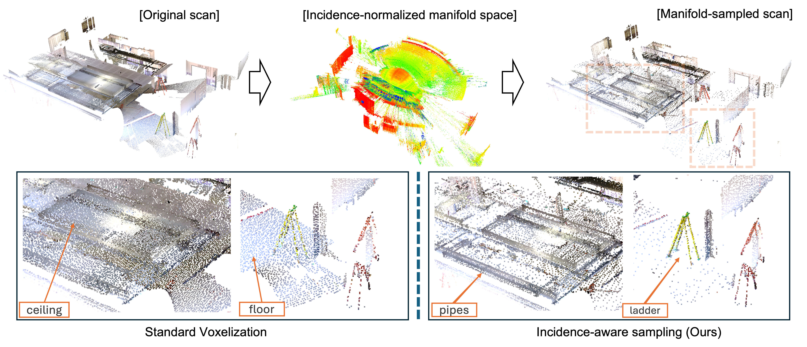

# Pointcept-SIP

This repository provides the [Sites in Pieces (SIP)](https://github.com/syoi92/SIP_dataset/)-specific implementation for 3D semantic segmentation experiments on single-scan construction LiDAR data.

## Modification Overview
This repository is based on the [Pointcept](https://github.com/Pointcept/Pointcept) at commit `5b10bc0`. All SIP-specific datasets, configurations, and engines are
implemented on top of that version.

- **`pointcept/datasets/`** 
  - `sip.py` *(added)* - Training and test datalaoders for SIP.
  - `transform.py` - added **SceneFragmentation** and **manifoldSampling**.

- **`pointcept/engines/`**
  - `train.py`, `test.py` - added **SIPFragmentTrainer** to support fragment-based training workflows
  - `hooks/evaluator.py `, `hooks/misc.py` - added Evaluator and Logger for fragment-based segmentation.

- **`pointcept/models/`**
  - `point_transformer/point_transformer_seg.py` - added **Seg74** backbone.
  - `pointnext/` - added **pointnext** backbone.


## Usage

### Data preparation

The raw dataset is available at [10.5281/zenodo.17667735](https://doi.org/10.5281/zenodo.17667735). Follow the [SIP_dataset](https://github.com/syoi92/SIP_dataset/) repository to prepare the training-ready tree; then link it under `./data`:

```sh
ln -s /path/to/preprocessed/sip-root data/sip
```

### Training / Test

```sh
sh scripts/train.sh -g "$GPU" -d "$Dataset" -c "$cfg" -n "$name"
sh scripts/test.sh -g "$GPU" -d "$Dataset" -c "$cfg" -n "$name" -w "$weight"
```

Example:

```sh
sh scripts/train.sh -g 0 -d sip -c seg-manifold -n seg-manifold-mdl1
```


## Incidence-aware Manifold Sampling
Single-scan LiDAR often over-represents dominant planar surfaces while sparsely capturing thin construction elements. Incidence-aware manifold sampling reduces this bias by selecting points in an incidence- and range-normalized space, while preserving the original Euclidean coordinates for downstream learning.

<p align="center">
  
</p>

<p align="center">
  <em>Incidence-aware manifold sampling for construction sites. Retained points are redistributed from redundant planar regions toward geometrically informative construction elements.</em>
</p>

### Main Results

We compare conventional grid sampling with incidence-aware manifold sampling across five sampling resolutions (`0.04m`, `0.06m`, `0.09m`, `0.13m`, and `0.18m`) using two segmentation backbones: PointNeXt (PNxt) and Point Transformer (PT).

Each resolution is evaluated over five random-seed runs. The table below reports performance averaged across the five sampling resolutions. NP-IoU and NP-Acc denote the mean IoU and accuracy over the non-planar classes (pipes, columns, ladders, and stairs), respectively.

| Backbone-Sampling | mIoU ↑ | NP-IoU ↑ | mAcc ↑ | NP-Acc ↑ | allAcc ↑ |
|:---------|-------:|---------:|-------:|---------:|---------:|
| PNxt-Grid | 41.6 | 17.0 | 52.4 | 29.8 | 79.7 |
| PNxt-**Manifold** | **44.7 (+3.1)** | **22.6 (+5.5)** | **56.4 (+4.0)** | **37.1 (+7.2)** | **79.8 (+0.2)** |
| PT-Grid | 64.0 | 46.6 | 73.1 | 58.2 | 90.1 |
| PT-**Manifold** | **68.7 (+4.7)** | **54.7 (+8.1)** | **77.7 (+4.6)** | **66.9 (+8.7)** | **91.9 (+1.8)** |

<sub>† Parenthetical values indicate the absolute improvement over grid sampling, computed from the unrounded resolution-averaged results. 

Manifold sampling improves resolution-averaged mIoU by **+3.1 points for PNxt** and **+4.7 points for PT**, with larger gains in NP-IoU (**+5.5** and **+8.1 points**, respectively). For resolution-wise and per-class results, as well as trained model checkpoints, see [RESULTS.md](RESULTS.md).


### Citation
```bibtex
@misc{kim2026rethinking,
  title        = {Rethinking 3D Segmentation from Individual LiDAR Scans: Incidence-Aware Sampling on the SIP Benchmark},
  author       = {Kim, Seongyong and Chen, Jingdao and Cho, Yong Kwon},
  year         = {2026},
  doi          = {10.48550/arXiv.2608.07757},
  url          = {https://arxiv.org/abs/2608.07757}
}
```