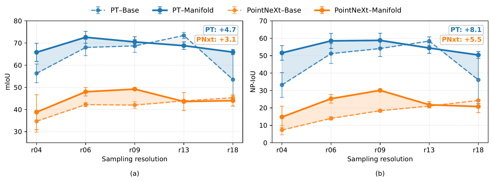

# Detailed Results

This page provides the resolution-wise results for incidence-aware manifold
sampling on the SIP dataset.

## Evaluation Protocol

Experiments are conducted with two segmentation backbones (**PointNeXt**, and **Point Transformer**), and each backbone is evaluated using:

- conventional **grid sampling**, and
- incidence-aware **manifold sampling**.

Five sampling resolutions are considered: `0.04m`, `0.06m`, `0.09m`, `0.13m`, and `0.18m`. Results are reported as **mean ± standard deviation over
five random-seed runs**. 

## Resolution-Averaged Results

| Backbone-Sampling | mIoU ↑ | NP-IoU ↑ | mAcc ↑ | NP-Acc ↑ | allAcc ↑ |
|:---------|-------:|---------:|-------:|---------:|---------:|
| PNxt-Grid | 41.6 | 17.0 | 52.4 | 29.8 | 79.7 |
| PNxt-**Manifold** | **44.7 (+3.1)** | **22.6 (+5.5)** | **56.4 (+4.0)** | **37.1 (+7.2)** | **79.8 (+0.2)** |
| PT-Grid | 64.0 | 46.6 | 73.1 | 58.2 | 90.1 |
| PT-**Manifold** | **68.7 (+4.7)** | **54.7 (+8.1)** | **77.7 (+4.6)** | **66.9 (+8.7)** | **91.9 (+1.8)** |

Parenthetical values indicate the change from grid to manifold sampling,
computed from the unrounded resolution-averaged results.

## Resolution-Wise Performance

**Figure.** Resolution-wise mIoU and NP-IoU for grid and manifold sampling
using PT and PNxt. NP denote the non-planar classes (pipes, columns, ladders, and stairs). Error bars indicate variation across five random-seed runs.

## Point Transformer (PT)

### Grid Sampling

| Metric | r04 | r06 | r09 | r13 | r18 |
|:-------|----:|----:|----:|----:|----:|
| Wall | 83.6 ± 0.9 | 87.3 ± 1.5 | 89.1 ± 0.7 | 88.9 ± 1.0 | 71.7 ± 15.3 |
| Ceiling | 86.3 ± 1.8 | 90.6 ± 1.3 | 91.0 ± 0.7 | 89.7 ± 1.2 | 79.3 ± 7.3 |
| Floor | 91.4 ± 1.0 | 93.3 ± 2.5 | 93.0 ± 2.8 | 96.8 ± 0.7 | 87.3 ± 8.1 |
| Pipes | 52.1 ± 12.9 | 67.1 ± 9.4 | 71.0 ± 4.1 | 61.8 ± 5.3 | 43.7 ± 15.6 |
| Column | 32.6 ± 9.1 | 42.0 ± 8.4 | 45.6 ± 11.1 | 63.4 ± 2.9 | 27.5 ± 22.1 |
| Ladder | 27.9 ± 19.9 | 60.6 ± 15.8 | 49.1 ± 7.7 | 50.1 ± 7.1 | 19.9 ± 11.0 |
| Stair | 20.1 ± 9.5 | 34.9 ± 9.1 | 42.1 ± 11.4 | 63.3 ± 9.5 | 44.9 ± 19.5 |
| **mIoU** | **56.3 ± 4.2** | **68.0 ± 3.7** | **68.7 ± 2.0** | **73.4 ± 1.4** | **53.4 ± 11.9** |
| **NP-IoU** | **33.2 ± 7.1** | **51.2 ± 5.7** | **54.1 ± 4.6** | **58.4 ± 2.4** | **36.1 ± 13.6** |

### Manifold Sampling

| Metric | r04 | r06 | r09 | r13 | r18 |
|:-------|----:|----:|----:|----:|----:|
| Wall | 79.4 ± 4.6 | 88.5 ± 0.6 | 87.9 ± 0.9 | 87.8 ± 1.0 | 85.4 ± 1.8 |
| Ceiling | 86.0 ± 2.5 | 90.6 ± 0.6 | 89.6 ± 1.2 | 88.4 ± 0.6 | 87.6 ± 2.0 |
| Floor | 88.6 ± 4.8 | 94.8 ± 0.5 | 95.4 ± 0.2 | 96.0 ± 0.6 | 95.7 ± 1.5 |
| Pipes | 68.0 ± 3.1 | 70.5 ± 0.6 | 64.5 ± 4.6 | 60.3 ± 2.6 | 57.8 ± 5.0 |
| Column | 37.5 ± 4.1 | 51.0 ± 6.5 | 44.7 ± 12.4 | 46.3 ± 12.1 | 41.4 ± 12.2 |
| Ladder | 66.2 ± 2.3 | 71.7 ± 9.7 | 62.7 ± 15.8 | 50.2 ± 7.7 | 38.4 ± 5.2 |
| Stair | 34.8 ± 8.8 | 41.1 ± 3.5 | 49.1 ± 0.9 | 52.6 ± 8.5 | 55.0 ± 18.6 |
| **mIoU** | **68.8 ± 4.1** | **72.6 ± 2.7** | **70.5 ± 2.4** | **68.8 ± 1.7** | **66.9 ± 1.2** |
| **NP-IoU** | **51.6 ± 4.2** | **58.5 ± 4.3** | **58.8 ± 4.1** | **54.4 ± 3.0** | **50.4 ± 1.9** |

## PointNeXt (PNxt)

### Grid Sampling

| Metric | r04 | r06 | r09 | r13 | r18 |
|:-------|----:|----:|----:|----:|----:|
| Wall | 68.3 ± 3.2 | 70.7 ± 3.4 | 64.9 ± 8.0 | 68.0 ± 6.4 | 60.3 ± 10.3 |
| Ceiling | 59.5 ± 15.2 | 80.5 ± 2.5 | 81.9 ± 0.9 | 80.5 ± 5.0 | 84.9 ± 1.0 |
| Floor | 86.9 ± 4.8 | 88.3 ± 3.3 | 85.3 ± 0.8 | 87.8 ± 3.9 | 91.8 ± 1.5 |
| Pipes | 16.6 ± 7.7 | 45.5 ± 9.5 | 46.6 ± 4.0 | 43.9 ± 8.2 | 49.4 ± 3.1 |
| Column | 7.5 ± 1.5 | 4.7 ± 3.3 | 6.7 ± 1.6 | 7.6 ± 0.6 | 7.2 ± 0.7 |
| Ladder | 0.1 ± 0.1 | 3.1 ± 2.7 | 5.9 ± 5.3 | 13.4 ± 5.9 | 6.2 ± 2.4 |
| Stair | 4.9 ± 1.5 | 2.7 ± 1.0 | 2.6 ± 2.6 | 6.0 ± 2.3 | 17.4 ± 1.3 |
| **mIoU** | **34.7 ± 4.9** | **42.2 ± 0.9** | **42.0 ± 1.5** | **43.9 ± 0.5** | **45.3 ± 1.3** |
| **NP-IoU** | **7.3 ± 2.7** | **14.0 ± 0.9** | **18.4 ± 0.8** | **21.1 ± 0.4** | **24.3 ± 0.6** |

### Manifold Sampling

| Metric | r04 | r06 | r09 | r13 | r18 |
|:-------|----:|----:|----:|----:|----:|
| Wall | 68.8 ± 1.7 | 66.0 ± 3.9 | 70.0 ± 3.8 | 69.3 ± 5.7 | 65.4 ± 1.8 |
| Ceiling | 59.8 ± 30.6 | 82.3 ± 1.2 | 82.7 ± 0.7 | 68.2 ± 18.4 | 79.7 ± 4.4 |
| Floor | 83.3 ± 1.9 | 86.6 ± 2.3 | 91.6 ± 2.2 | 93.3 ± 0.2 | 92.3 ± 0.5 |
| Pipes | 31.6 ± 16.7 | 52.8 ± 1.6 | 55.1 ± 3.0 | 27.6 ± 14.5 | 38.1 ± 7.3 |
| Column | 2.8 ± 0.1 | 9.2 ± 0.4 | 9.5 ± 2.0 | 8.8 ± 0.2 | 7.9 ± 1.3 |
| Ladder | 19.6 ± 8.1 | 30.5 ± 5.3 | 23.9 ± 5.6 | 24.6 ± 10.2 | 14.6 ± 2.8 |
| Stair | 5.1 ± 0.1 | 8.8 ± 4.0 | 11.4 ± 0.5 | 13.1 ± 0.6 | 9.7 ± 5.0 |
| **mIoU** | **38.8 ± 7.9** | **48.0 ± 1.9** | **49.2 ± 0.5** | **43.6 ± 4.1** | **44.0 ± 2.5** |
| **NP-IoU** | **14.8 ± 6.2** | **25.3 ± 2.5** | **30.1 ± 0.4** | **21.8 ± 1.8** | **20.8 ± 3.5** |

## Checkpoints

Trained checkpoints are available
[here](https://drive.google.com/drive/folders/1lliinkNNqGT6Egyciv5YeUAVdj_OswDB?usp=sharing). Checkpoint names indicate the corresponding backbone, sampling configuration, resolution, and random seed.